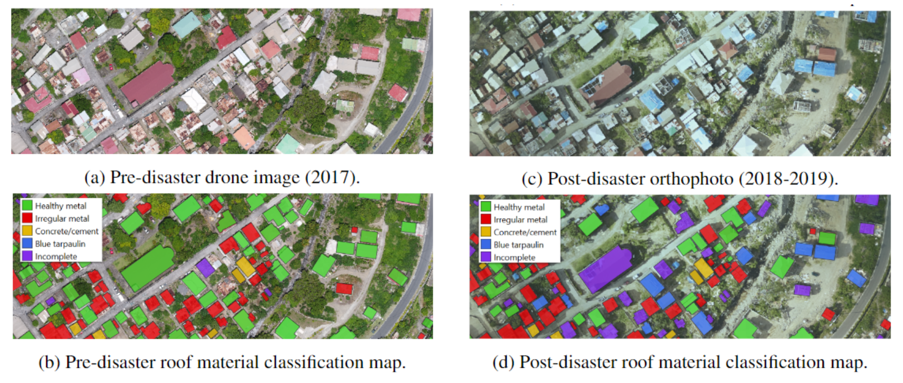
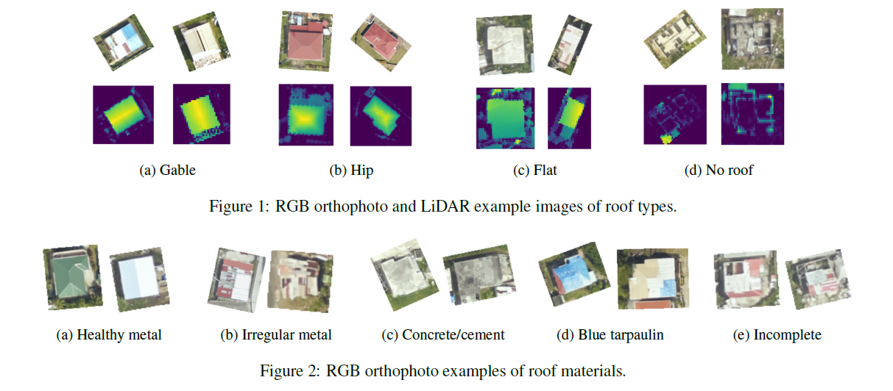

<div align="center">

# Digital Earth for a Resilient Caribbean 
Data Fusion of Post-disaster Aerial Imagery and LiDAR Data for Rooftop Classification using CNNs

<p>
<b><a href="#-description">Description</a></b>
|
<b><a href="#-datasets">Datasets</a></b>
|
<b><a href="#-methods">Methods</a></b>
|
<b><a href="#-file-organization">File Organization</a></b>
|
<b><a href="#citation">Citation</a></b>
</p>

</div>

<a href="https://www.python.org/"></a>
<a href="https://black.readthedocs.io/en/stable/"></a>

## 📜 Description
This work leverages convolutional neural networks (CNNs) and data fusion techniques for the automated classification of rooftop  characteristics from very high-resolution orthophotos and airborne LiDAR data. 

The Digital Earth for a Resilient Caribbean project aims help governments produce more timely building information to improve resilience and disaster response in the Caribbean.
<p>


## 📂 Datasets
To generate our ground truth dataset, we used the following three data sources for Dominica and St. Lucia: (1) VHR aerial imagery, (2) LiDAR data, and (3) building footprints in the form of georeferenced vector polygons.

### Roof Characteristics
We annotated a total of 8,345 buildings according to two attributes: (1) roof type and (2) roof material. The following figures below illustrate examples of the RGB orthophoto and LiDAR-derived image patches.
<p>


## 💹 Methods
### Data Fusion Strategies
We experiment with different data fusion strategies for combining RGB orthophotos and LiDAR data.

<b>A. Feature-level Data Fusion</b> - deep feature representations extracted from one or more modalities are concatenated to produce an enriched set of characteristics.

<b>B. Decision-level integration</b> -  fuses the results of prior classification models using model stacking/model blending techniques, e.g. getting the mean of the softmax layers or by concatenating the softmax layers into a single vector to be used as input into an auxiliary ML model.

## ⚙️ Setup
This repo assumes the use of [conda](https://docs.conda.io/en/latest/miniconda.html) for simplicity in installing GDAL. More info on how to install GDAL can be found [here](https://ljvmiranda921.github.io/notebook/2019/04/13/install-gdal/).

### One-time Set-up
1. Install Anaconda/Miniconda for your environment from [here](https://docs.conda.io/en/latest/miniconda.html).
2. Create a local python environment and activate it.
* Note:
    * You can change the name if you want; in this example, the env name is `venv`.
```bash
conda create -n venv
conda activate venv
```
3. Clone this repo and navigate into the folder. For example:
```bash
git clone https://github.com/GFDRR/caribbean-rooftop-classification.git
cd caribbean-rooftop-classification
```
4. Install the project dependencies by running:
```bash
pip install -r requirements.txt 
```

## 🗄 File Organization
### Data Directory
The datasets are organized as follows:
```
data
├── csv/version-02
│   ├── roof_material.csv
│   └── roof_type.csv
├── rasters
│   ├── drone
│   │   └── drone_colihaut_DOM.tif
│   ├── lidar
│   │   ├── dsm_DOM.tif
│   │   ├── dtm_DOM.tif
│   │   └── ndsm_DOM.tif
│   ├── ortho
│   │   └── ortho_DOM.tif
│   └── tiles/version-02
│     	├── ndsm
│       │   ├── roof_material
│       │   │   ├── BLUE_TARP
│       │   │   ├── CONCRETE_CEMENT
│       │   │   ├── HEALTHY_METAL
│       │   │   ├── IRREGULAR_METAL
│       │   │   └── INCOMPLETE
│       │   └── roof_type
│       │       ├── FLAT
│       │       ├── GABLE
│       │       ├── HIP
│       │       └── NO_ROOF
│       └── ortho
│           ├── roof_material
│           └── roof_type
└── vectors/version-02
    ├── annotation_tiles_DOM.gpkg
    ├── building_footprints_DOM.gpkg
    ├── building_footprints_annotated_DOM.gpkg
    └── geoboundaries_DOM.gpkg
```

## Citation
Use this bibtex to cite this repository:
```
@misc{caribbean_roof_detection_2023,
  title={Data Fusion of Post-disaster VHR Aerial Imagery and LiDAR Data for Roof Classification using Convolutional Neural Networks},
  author={Tingzon, Isabelle Cowan, Nuala Margaret and Chrzanowski, Pierre},
  year={2023},
  howpublished={\url{https://github.com/GFDRR/caribbean-rooftop-classification}},
}
```